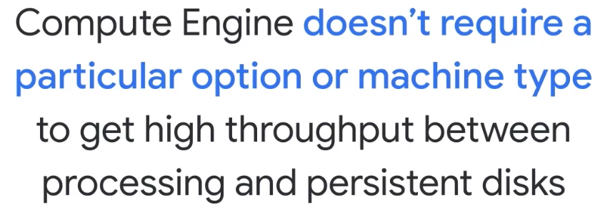

# Virtual Machines and Networks in the Cloud
## Virtual Private Cloud (VPC) networking
Many users start with google cloud by defining their own virtual private cloud inside their first GCP project.

A VPC is a secure, individual private cloud-computing model hosted within a public cloud, like google cloud.

Inside a VPC users can run code, store data, host websites and anything else that can be done in an ordinary private cloud.
A virtual private cloud (VPC) is hosted remotely by a public cloud provider, like google cloud.

## Compute Engine - GCPs IaaS solution
Enables developers to create and run virtual machines on Google infrastructure 

**Running a virtual machine on GCP**

**What about cost and billing for using Compute Engine?**
Compute Engine bills by the second, with a 1 minute minimum.

### There's 3 discounts available for Compute Engine:
**Sustained-use discounts** are available when running VMs using Compute Engine. The longer you run it, the cheaper the cost/second.
*For each VM that runs for more than 25% of the month, Compute Engine automatically applies a discount for every additional minute!*

Compute Engine also offers **Commited-use discounts**. This is a discount applied to stable and predictable workloads, where a specific amount of CPU and memory can be purchased for up to a 57% discount in return of committing to a usage term of 1 or 3 years.

The third and best discount is the **Preemptible & Spot VMs discount**. Let's say that you have a lot of non-human required procedures, such as a nightly-running batch job, you can save money by **UP TO 90%** by choosing Preemptible & Spot VMs.

### Preemptible & Spot VMs  

Preemptible & Spot VMs differs from ordinary Compute Engine in only one respect, **Compute Engine has permission to terminate an ongoing job if its resources are needed elsewhere**.

## Scaling virtual machines in GCP  
Compute Engine has a feature called **Autoscaling**.
Autoscaling is an option which enables VMs to be added or subtracted from an application based on load metrics. Another thing the autoscaling feature gives you is automated load balancing, where the incoming traffic is balanced among the VMs.

*VPC supports several different kinds of load balancers (which we'll explore shortly).*

## Important VPC compatibilities
VPCs in GCP features routing tables. Routing tables are built-in and requires no managing but it's still good to know about it.

VPCs in GCP also offers firewalls.

### What if your company have multiple GCP projects and VPCs need to talk to each other?
With **VPC Peering**, two VPCs can establish a connection to exchange traffic. Alternatively, to use the full power of IAM, and share that config between multiple VPCs, you can then use a **Shared VPC**.

## Cloud Load Balancing

Cloud Load Balancing provides single as well as cross-region load balancing, including automatic multi-region failover.
Also, no "pre-warming" is required for anticipated spikes in traffic.

## Cloud DNS and Cloud CDN
One of the most famous free Google services is the 8.8.8.8 service, which provides a public domain name service (DNS) to the world.

### DNS
Domain Name Service (DNS) is what translates internet hostnames to IP-addresses.

**What about the internet hostnames and IP addresses of applications built in Google Cloud?**
Google Cloud offers the product **Cloud DNS**, to help the world find them.

CDN (Content Delivery Networks) are available in Google Cloud through the **Cloud CDN**.
Cloud CDN offers lower network latency for your users and visitors, it saves money and is easily toggled with a single checkbox.

## Connecting networks to Google VPC  
It is very common that you want to connect other networks, such as an on-prem network, with your Google Cloud network.
There are several effective ways of accomplishing this:

### Start with a VPC over the internet and use the IPSec VPN protocol
Use the IPSec VPN protocol to create a tunnel connection.

To make the connection dynamic, a GCP feature called **Cloud Router** can be used.
Cloud Router lets other networks and Google VPC exchange route information over VPN using the **Border Gateway Protocol**.
This is not always the best solution because of security concerns or bandwidth reliability.

### Direct Peering
Direct Peering means putting a router in the same public datacenter as Google Point of Presence (PoP), and then use that router to exchange traffic between the two networks.

### Others
There's some more methods to use for connecting networks to Google VPC but I didn't have time to write them down here since they're too long to cover.