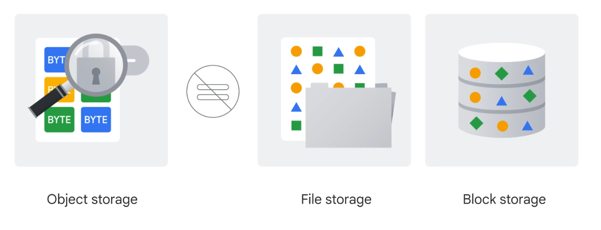
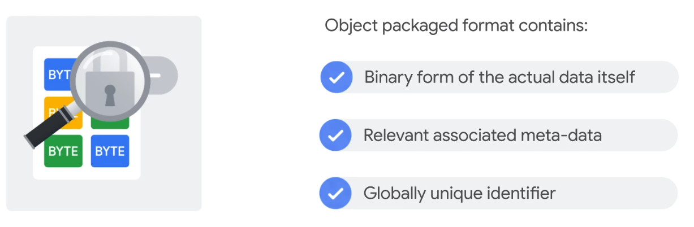
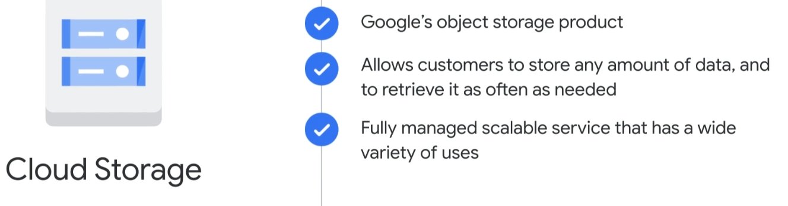
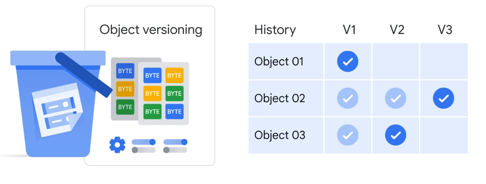
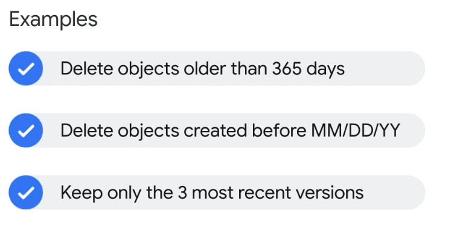
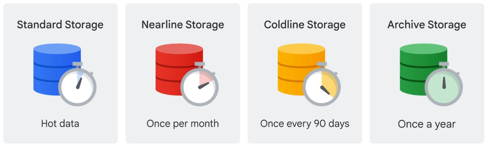
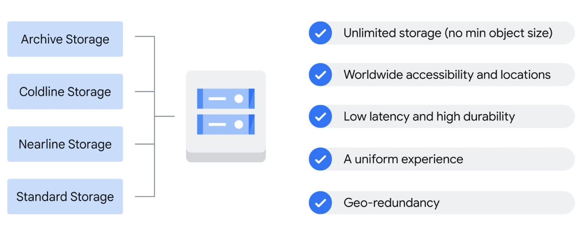

# Storage in the Cloud
## Cloud Storage
Offers developers and organizations durable and highly available object storage.

**But what is Object Storage?**

The keys in object storage are in the form or URLs, which means object storage interacts well with web technologies.

Data commonly stored as objects include videos, pictures and audio recordings.

**Cloud Storage is well suited for serving website content, archival and disaster recovery, and direct download of files.**
Cloud Storage is primarily used whenever binary large-object (BLOB) storage is needed for online content such as videos, backup and archiving, or as a storage of intermediate results (such as in processing workflows).

### Cloud Storage Buckets
Cloud Storage files are organized into buckets.
A bucket needs a globally unique identifier and a specific geographic location for where it should be stored.

Objects stored in Cloud Storage are immutable, which means that you can't edit them but instead create new versions whenever changes are made.

There's the possibility to decide whether or not to enable versioning for your bucket. With versioning enabled, you can keep track of the change history for your objects

### Lifecycle Policies in Cloud Storage
Because storing and retrieving large amount of objects can become expensive or you may want to automatically delete specific data after a certain amount of time, there's lifecycle policies featured in Cloud Storage.

## Cloud Storage: Storage Classes and data transfers
There are four primary storage classes in Cloud Storage

## Cloud SQL  
