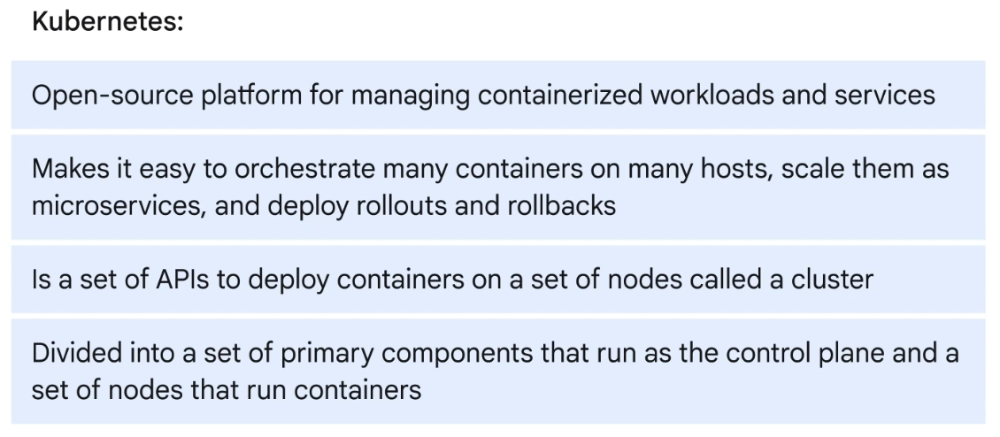
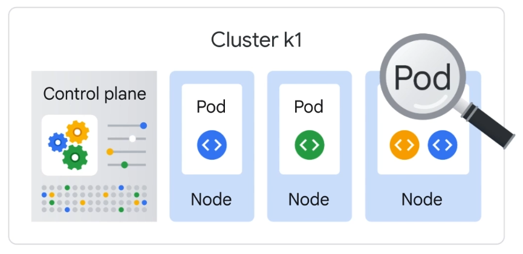
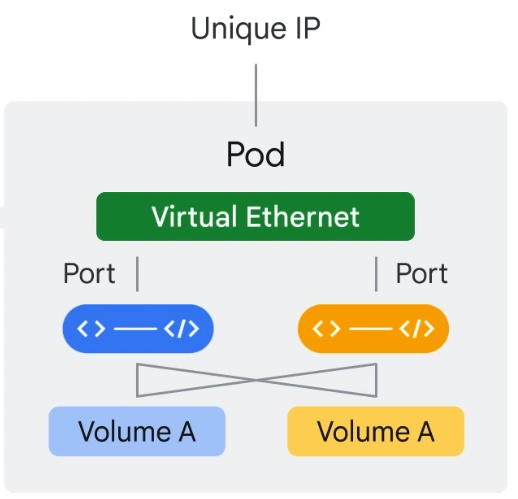
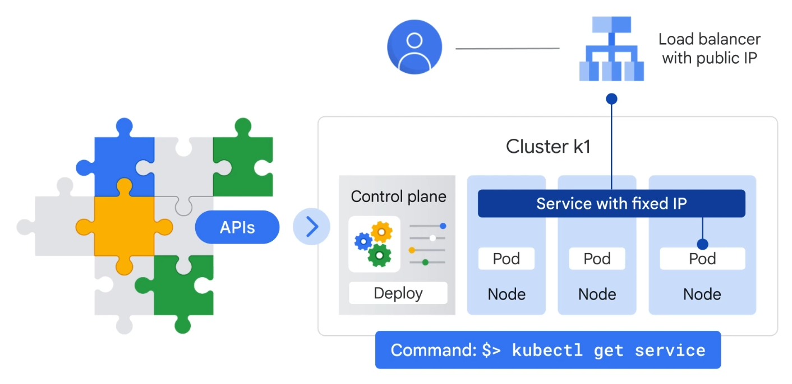
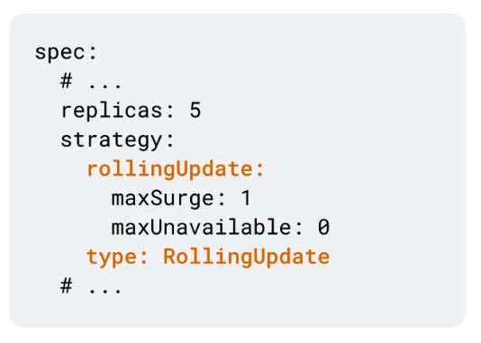
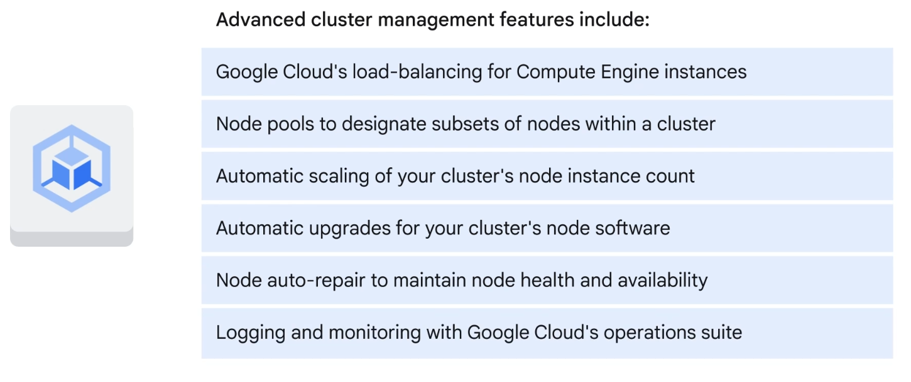

# Containers in the Cloud
When running containers on GCP, you utilize the service **App Engine**.
## Kubernetes

  
Kubernetes is divided into a set of primary components that run as the **Control Plane** and a set of nodes that run containers.  
  
Deploying containers on nodes by using a wrapper around one or more containers is what defines a **Pod**.

A pod is the smallest unit in Kubernetes that you create or deploy. It represents a running process on your cluster as either a component of your application or an entire app.  
  
**Generally, you only have one container per pod**. But if you have multiple containers with a hard dependency, you can package them into the same pod and then let them share the same networking and storage resources.  
  
  
**How do I run a container in a pod in Kubernetes?**  
```bash
kubectl run
```  
  
**How do I list running pods in Kubernetes?**  
```bash
kubectl get pods
```  

**Let consumers outside the cluser access your application**  
```bash
kubectl expose deployments nginx --port=80 --type=LoadBalancer
```  
  
### Service in Kubernetes

A service in Kubernetes is an abstraction, which defines a logical set of pods and a policy by which to access them. As deployments create and destroy pods, pods will be assigned their own IP address, but those addresses don't remain stable over time. **A service is a set of pods and provides a stable endpoint or fixed IP address for them.**  
  
**How do I scale a deployment in Kubernetes?**  
```bash
kubectl scale
```  
  
### Deployment Configuration Files  
**Example of a Deployment Config File**  
  
You can run the `kubectl get deployments` command to get a deployment configuration file.  
  
To apply a deployment configuration file, you can run the following command:  
```bash
kubectl apply -f nginx-deployment.yaml
```  
*where nginx-deployment.yaml is the name of your deployment config file*  
  
You can double-check your deployment by running this command:
```bash
kubectl get deployments
```  
or this command:  
```bash
kubectl describe deployments
```  
  
When your Kubernetes service is running, you can get the external IP of it with this command:  
```bash
kubectl get services
```  
  
### Deploy new versions of your service without causing issues for the users  
You can deploy a new version of your application by adding this to your deployment configuration file:  
  
and then run the following command:  
```bash
kubectl rollout
```  
  
### GKE (Google Kubernetes Engine)  
  
  
To start a new Kubernetes cluster in GKE, using gcloud, you run this command:  
```bash
gcloud container clusters create k1
```  
*where k1 is the name of your cluster*  
  
