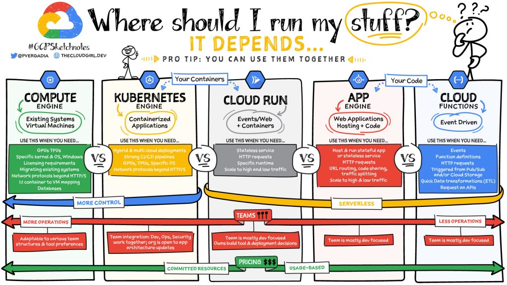

# Notes  
## CLI  
### gcloud
gcloud is the CLI used for communicating with GCP  
  
### gsutil
gsutil is the CLI used for communicating with Cloud Storage in GCP  
  
### Cheat Sheets  

## Other Notes  
